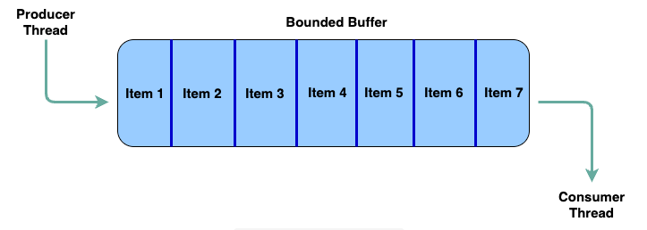

## Problem Statement

A blocking queue is defined as a queue which blocks the caller of the enqueue method if there's no more capacity to add the new item being enqueued. Similarly, the queue blocks the dequeue caller if there are no items in the queue. Also, the queue notifies a blocked enqueuing thread when space becomes available and a blocked dequeuing thread when an item becomes available in the queue.



### Solution
Our queue will have a finite size that is passed in via the constructor. Additionally, we'll use an array as the data structure for backing our queue. Furthermore, we'll expose the APIs enqueue and dequeue for our blocking queue class. We'll also need a head and a tail pointer to keep track of the front and back of the queue and a size variable to keep track of the queue size at any given point in time. Given this, the skeleton of our blocking queue class would look something like below:

```java
public class BlockingQueue<T> {

    T[] array;
    int size = 0;
    int capacity;
    int head = 0;
    int tail = 0;

    public BlockingQueue(int capacity) {
        array = (T[]) new Object[capacity];
        this.capacity = capacity;
    }

    public void enqueue(T item) {
    }

    public T dequeue() {
    }
}
```