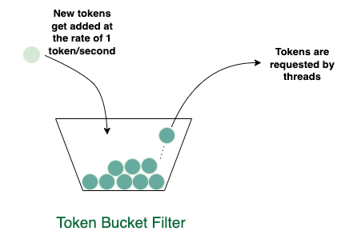

## Problem Statement
This is an actual interview question asked at Uber and Oracle.

Imagine you have a bucket that gets filled with tokens at the rate of 1 token per second. The bucket can hold a maximum of N tokens. Implement a thread-safe class that lets threads get a token when one is available. If no token is available, then the token-requesting threads should block.

The class should expose an API called getToken that various threads can call to get a token



### Solution
This problem is a naive form of a class of algorithms called the "token bucket" algorithms. A complimentary set of algorithms is called "leaky bucket" algorithms. One application of these algorithms is shaping network traffic flows.

The key to the problem is to find a way to track the number of available tokens when a consumer requests for a token. Note the rate at which the tokens are being generated is constant. So if we know when the token bucket was instantiated and when a consumer called getToken() we can take the difference of the two instants and know the number of possible tokens we would have collected so far. However, we'll need to tweak our solution to account for the max number of tokens the bucket can hold. Let's start with the skeleton of our class

```java
public class TokenBucketFilter {

    private int MAX_TOKENS;
    // variable to note down the latest token request.
    private long lastRequestTime = System.currentTimeMillis();
    long possibleTokens = 0;

    public TokenBucketFilter(int maxTokens) {
        MAX_TOKENS = maxTokens;
    }

    synchronized void getToken() throws InterruptedException {

    }
}
```